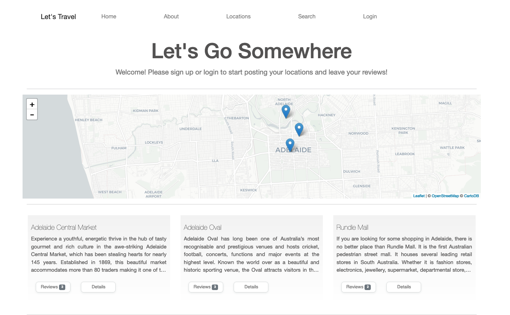
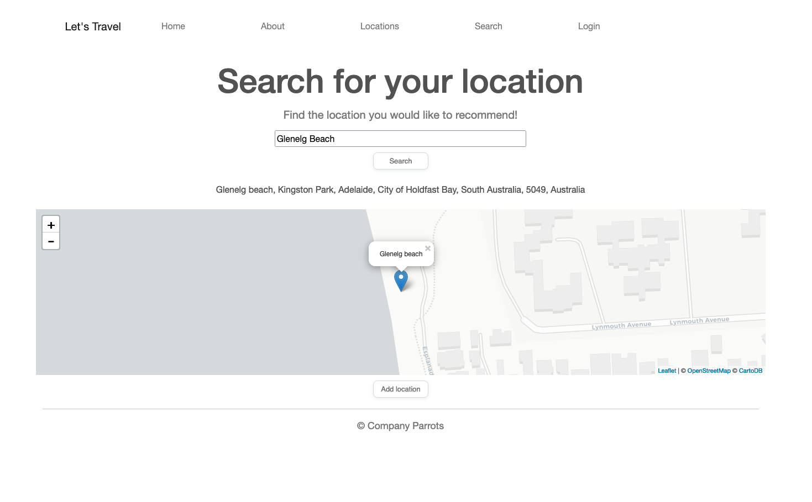
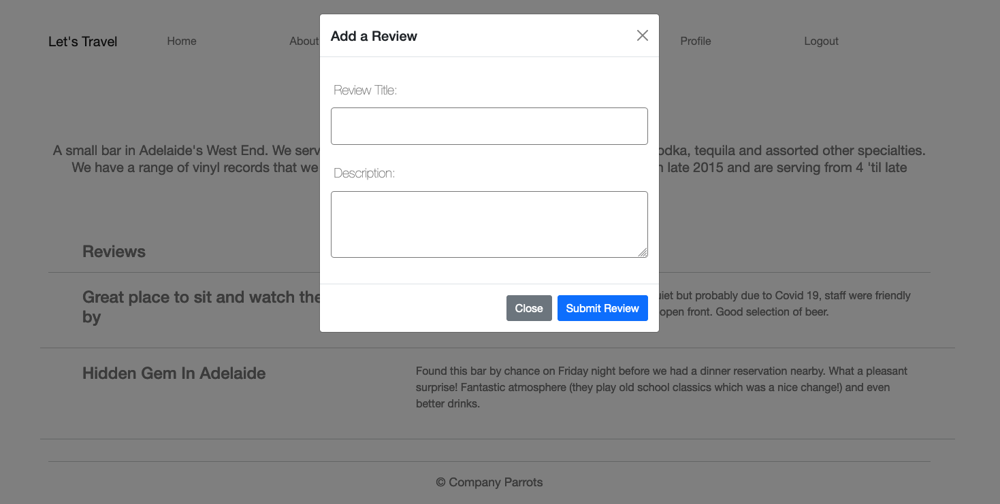

# LET’S GO SOMEWHERE

## Table of Contents
- [Description](#description)
- [Usage](#usage)
- [Credits](#credits)
- [License](#license)

## Description
COVID 19 has nearly wiped out travel as we know it, and now with the world slowly reopening it’s time to feed your travel bug and discover new places to explore. Let’s Go Somewhere allows you to interact with a world map to find new places to visit, leave reviews based on your experience, and read about other people’s experiences.

### User Story
As a keen traveller, I want an application that provides locations and reviews, so that I can explore new locations in my local area.

### Technologies Used
- Sequelize 
- Node
- MySQL
- Leaflet
- Handlebars
- Express
- BCrypt
- DotEnv

## Usage
Visit the live site at: https://party-parrots.herokuapp.com

You can search for a location to add:

Add reviews for your favourite places:

## Credits
The collaborators for this project were: 
- Stefanie Buntz - https://github.com/sbuntz 
- Joseph Daw - https://github.com/josephdaw
- Alex Groat - https://github.com/AlexGroat

## License
This project is released under the [MIT License](LICENSE)